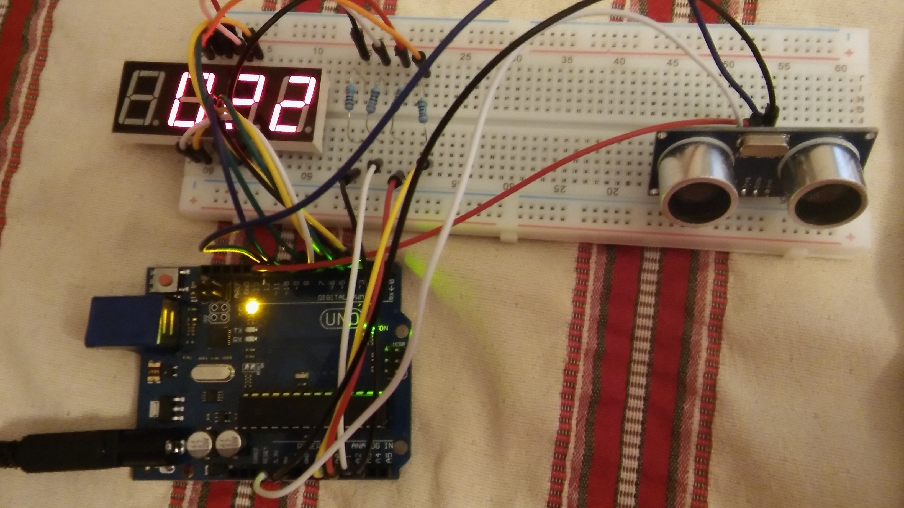
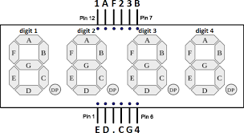
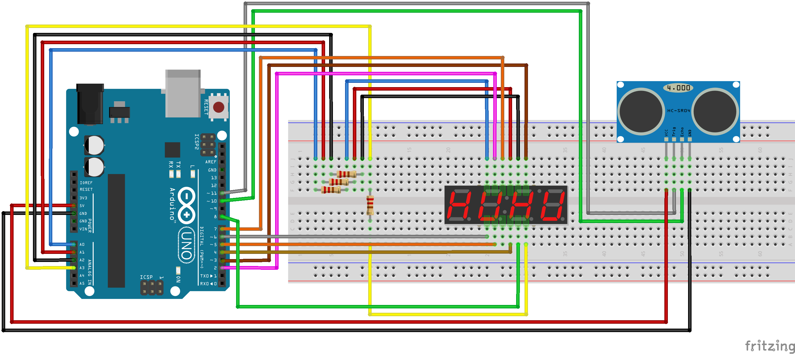
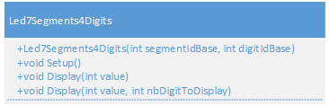
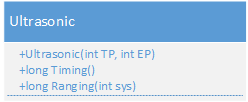

# Arduino Electronic Meter

An Arduino-based digital distance meter using an ultrasonic sensor HC-SR04 and a 4-digit 7-segment LED display.



## Description

This project implements a digital distance meter that measures distances using an ultrasonic sensor and displays the results on a 4-digit 7-segment LED display. The distance is measured in centimeters and updated every second.

## Components

- **Arduino Uno**
- **Ultrasonic sensor HC-SR04** - for distance measurement
- **4-digit 7-segment LED display 5641BH** - for displaying measurements
- Connecting wires and breadboard



## Hardware Setup

### Wiring Diagram



### Pin Connections

#### 7-Segment Display (5641BH)
- Segment A: Digital Pin 2
- Segment B: Digital Pin 3  
- Segment C: Digital Pin 4
- Segment D: Digital Pin 5
- Segment E: Digital Pin 6
- Segment F: Digital Pin 7
- Segment G: Digital Pin 8
- Digit 1: Digital Pin 14 (A0)
- Digit 2: Digital Pin 15 (A1)
- Digit 3: Digital Pin 16 (A2)
- Digit 4: Digital Pin 17 (A3)



#### Ultrasonic Sensor HC-SR04
- Trig Pin: Digital Pin 11
- Echo Pin: Digital Pin 10
- VCC: 5V
- GND: Ground



## Software Architecture

The project is organized into several modules:

### Main File
- `metrenumerique.ino` - Main Arduino sketch that coordinates the sensor reading and display

### Libraries
- `Ultrasonic.h/.cpp` - Library for managing the HC-SR04 ultrasonic sensor
- `Display4Digit7Segments.h/.cpp` - Custom library for controlling the 4-digit 7-segment display, using a `Segments[12][8]` array to define which segments to turn on or off for each digit

### Display4Digit7Segments Class

The `Display4Digit7Segments` class is a custom implementation that manages the display on a 4-digit 7-segment display. It uses a two-dimensional array `Segments[12][8]` that defines the segment configurations for:
- Digits 0-9
- An "off" state (all segments off)
- The "-" symbol (dash)

Each row of the array corresponds to a digit or symbol, and each column corresponds to a segment (A, B, C, D, E, F, G). The value `LOW` turns the segment on, `HIGH` turns it off, allowing precise display control.

**Arduino Best Practices Note**: Using `LOW` to turn on LEDs or other components is part of Arduino best practices. This approach reduces current consumption by using Arduino pins as current "sinks" rather than current "sources", which is more efficient and better protects the microcontroller.

## Features

- **Real-time distance measurement** - Updates every second
- **Centimeter precision** - Displays distance in centimeters
- **4-digit display** - Shows distances up to 9999 cm
- **Modular design** - Separate libraries for sensor and display management
- **Efficient multiplexing** - Smooth display without flickering

## How It Works

1. **Initialization**: The Arduino sets up the ultrasonic sensor and 7-segment display
2. **Distance Measurement**: Every second, the ultrasonic sensor measures the distance to the nearest object
3. **Display Update**: The measured distance is converted to individual digits and displayed on the 7-segment display
4. **Continuous Loop**: The process repeats continuously, providing real-time distance readings

## Installation and Usage

1. **Hardware Setup**: Connect the components according to the wiring diagram
2. **Software Setup**: 
   - Open the Arduino IDE
   - Load the `src/metrenumerique.ino` file
   - Ensure all library files are in the same directory
3. **Upload**: Compile and upload the code to your Arduino Uno
4. **Operation**: Once powered on, the meter will automatically start measuring and displaying distances

## Code Structure

```
src/
├── metrenumerique.ino          # Main Arduino sketch
├── Ultrasonic.h                # Ultrasonic sensor library header
├── ultrasonic.cpp              # Ultrasonic sensor library implementation
├── Display4Digit7Segments.h    # 7-segment display library header
└── Display4Digit7Segments.cpp  # 7-segment display library implementation
```

## Technical Specifications

- **Measurement Range**: 2-400 cm (typical for HC-SR04)
- **Measurement Accuracy**: ±3mm
- **Update Rate**: 1 second
- **Display Range**: 0-9999 cm
- **Power Supply**: 5V via Arduino USB or external adapter

## License

This project is released under the MIT License. See the source code headers for full license information.

## Author

**thlg** - 2017

## Acknowledgments

- Based on Haljia Arduino starter kit components

## Troubleshooting

### Common Issues

1. **Display not working**: Check all pin connections for the 7-segment display
2. **Incorrect readings**: Verify ultrasonic sensor wiring (Trig/Echo pins)
3. **No display**: Ensure proper power supply (5V) to all components
4. **Flickering display**: Check that all ground connections are secure

### Tips

- Keep the ultrasonic sensor away from obstacles during measurements
- Ensure the target surface is flat and perpendicular for accurate readings
- Avoid measuring very close objects (less than 2cm) or very distant ones (more than 4m)