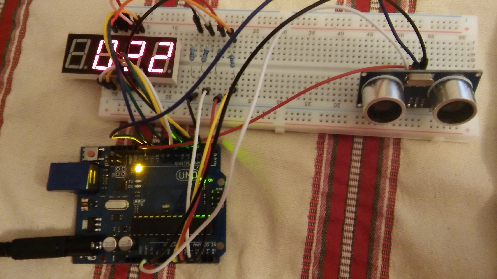
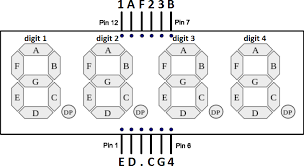
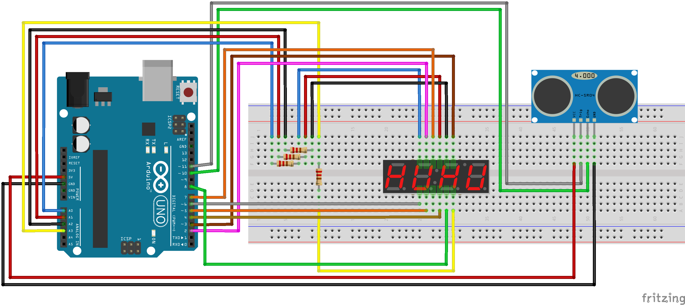
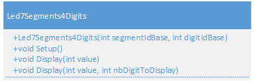
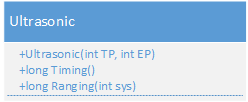

# Mètre Électronique Arduino

Un mètre électronique basé sur Arduino utilisant un capteur ultrasonique HC-SR04 et un afficheur LED 7 segments à 4 chiffres.



## Description

Ce projet implémente un mètre électronique qui mesure les distances à l'aide d'un capteur ultrasonique et affiche les résultats sur un afficheur LED 7 segments à 4 chiffres. La distance est mesurée en centimètres et mise à jour chaque seconde.

## Composants

- **Arduino Uno**
- **Capteur ultrasonique HC-SR04** - pour la mesure de distance
- **Afficheur LED 7 segments 4 chiffres 5641BH** - pour l'affichage des mesures
- Fils de connexion et plaque d'essai



## Configuration Matérielle

### Schéma de Câblage



### Connexions des Broches

#### Afficheur 7 Segments (5641BH)
- Segment A : Broche Numérique 2
- Segment B : Broche Numérique 3  
- Segment C : Broche Numérique 4
- Segment D : Broche Numérique 5
- Segment E : Broche Numérique 6
- Segment F : Broche Numérique 7
- Segment G : Broche Numérique 8
- Chiffre 1 : Broche Numérique 14 (A0)
- Chiffre 2 : Broche Numérique 15 (A1)
- Chiffre 3 : Broche Numérique 16 (A2)
- Chiffre 4 : Broche Numérique 17 (A3)



#### Capteur Ultrasonique HC-SR04
- Broche Trig : Broche Numérique 11
- Broche Echo : Broche Numérique 10
- VCC : 5V
- GND : Masse



## Architecture Logicielle

Le projet est organisé en plusieurs modules :

### Fichier Principal
- `metrenumerique.ino` - Sketch Arduino principal qui coordonne la lecture du capteur et l'affichage

### Bibliothèques
- `Ultrasonic.h/.cpp` - Bibliothèque pour gérer le capteur ultrasonique HC-SR04
- `Display4Digit7Segments.h/.cpp` - Bibliothèque personnalisée pour contrôler l'afficheur 7 segments à 4 chiffres, utilisant un tableau `Segments[12][8]` pour définir quels segments allumer ou éteindre pour chaque chiffre

### Classe Display4Digit7Segments

La classe `Display4Digit7Segments` est une implémentation personnalisée qui gère l'affichage sur un afficheur 7 segments à 4 chiffres. Elle utilise un tableau bidimensionnel `Segments[12][8]` qui définit les configurations de segments pour :
- Les chiffres 0-9
- Un état "éteint" (tous segments éteints)
- Le symbole "-" (tiret)

Chaque ligne du tableau correspond à un chiffre ou symbole, et chaque colonne correspond à un segment (A, B, C, D, E, F, G). La valeur `LOW` allume le segment, `HIGH` l'éteint, permettant un contrôle précis de l'affichage.

**Note sur les bonnes pratiques Arduino** : L'utilisation de `LOW` pour allumer les LEDs ou autres composants fait partie des bonnes pratiques Arduino. Cela permet de réduire la consommation de courant en utilisant les broches Arduino comme "sink" (puits de courant) plutôt que comme "source", ce qui est plus efficace et protège mieux le microcontrôleur.

## Fonctionnalités

- **Mesure de distance en temps réel** - Mise à jour chaque seconde
- **Précision au centimètre** - Affiche la distance en centimètres
- **Affichage 4 chiffres** - Affiche les distances jusqu'à 9999 cm
- **Conception modulaire** - Bibliothèques séparées pour la gestion du capteur et de l'affichage
- **Multiplexage efficace** - Affichage fluide sans scintillement

## Fonctionnement

1. **Initialisation** : L'Arduino configure le capteur ultrasonique et l'afficheur 7 segments
2. **Mesure de Distance** : Chaque seconde, le capteur ultrasonique mesure la distance à l'objet le plus proche
3. **Mise à Jour de l'Affichage** : La distance mesurée est convertie en chiffres individuels et affichée sur l'afficheur 7 segments
4. **Boucle Continue** : Le processus se répète en continu, fournissant des lectures de distance en temps réel

## Installation et Utilisation

1. **Configuration Matérielle** : Connectez les composants selon le schéma de câblage
2. **Configuration Logicielle** : 
   - Ouvrez l'IDE Arduino
   - Chargez le fichier `src/metrenumerique.ino`
   - Assurez-vous que tous les fichiers de bibliothèque sont dans le même répertoire
3. **Téléversement** : Compilez et téléversez le code sur votre Arduino Uno
4. **Fonctionnement** : Une fois alimenté, le mètre commencera automatiquement à mesurer et afficher les distances

## Structure du Code

```
src/
├── metrenumerique.ino          # Sketch Arduino principal
├── Ultrasonic.h                # En-tête de la bibliothèque capteur ultrasonique
├── ultrasonic.cpp              # Implémentation de la bibliothèque capteur ultrasonique
├── Display4Digit7Segments.h    # En-tête de la bibliothèque afficheur 7 segments
└── Display4Digit7Segments.cpp  # Implémentation de la bibliothèque afficheur 7 segments
```

## Spécifications Techniques

- **Plage de Mesure** : 2-400 cm (typique pour HC-SR04)
- **Précision de Mesure** : ±3mm
- **Taux de Mise à Jour** : 1 seconde
- **Plage d'Affichage** : 0-9999 cm
- **Alimentation** : 5V via USB Arduino ou adaptateur externe

## Licence

Ce projet est publié sous la licence MIT. Voir les en-têtes du code source pour les informations complètes de licence.

## Auteur

**thlg** - 2017

## Remerciements

- Basé sur les composants du kit de démarrage Arduino Haljia

## Dépannage

### Problèmes Courants

1. **L'affichage ne fonctionne pas** : Vérifiez toutes les connexions des broches de l'afficheur 7 segments
2. **Lectures incorrectes** : Vérifiez le câblage du capteur ultrasonique (broches Trig/Echo)
3. **Pas d'affichage** : Assurez-vous d'une alimentation appropriée (5V) pour tous les composants
4. **Affichage scintillant** : Vérifiez que toutes les connexions de masse sont sécurisées

### Conseils

- Gardez le capteur ultrasonique éloigné des obstacles pendant les mesures
- Assurez-vous que la surface cible est plate et perpendiculaire pour des lectures précises
- Évitez de mesurer des objets très proches (moins de 2cm) ou très distants (plus de 4m)